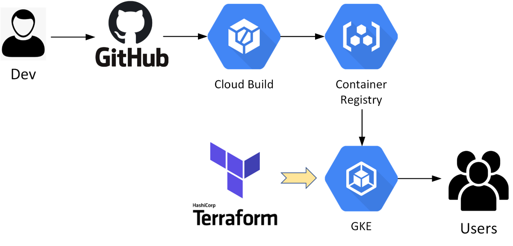

## Prerequisites

A basic Python app on Google Kubernetes Engine (GKE) using Docker for containerization.
This includes a simple CI/CD pipeline deployed in the Google Cloud (GCP) environment, leveraging cloud-native platforms and pipeline tools such as Google Kubernetes Engine (GKE), Google Cloud Build, and Google Container Registry (GCR).
